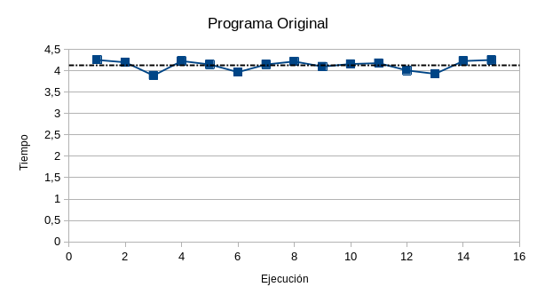
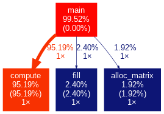
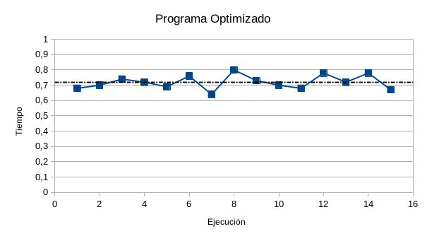
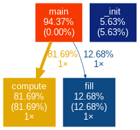
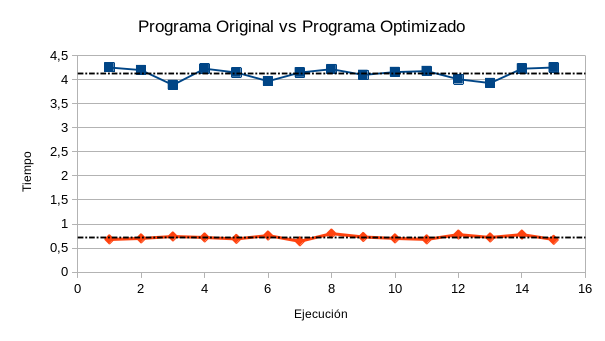

# Optimización de un programa en C

<p align="justify">
    El programa implementa una operación de convolución en una matriz bidimensional de tamaño <code>XDIMxYDIM</code>, donde se aplica un filtro de convolución de 3x3 definido por el arreglo de enteros kern. La matriz se crea utilizando la función <code>alloc_matrix()</code>, que reserva memoria necesaria y la inicializa con valores consecutivos. Posterior a esto, la función <code>fill()</code> se utiliza para llenar la matriz con valores aleatorios entre 0 y 99 para luego con la función <code>compute()</code>, aplicar el filtro de convolución a cada píxel de la misma. Finalmente, utilizando la función <code>print()</code>, se imprimen los valores finales de la matriz después de aplicar el filtro de convolución.
</p>

### Autores:
- **Bottini, Franco Nicolas**

## Analisis del rendimiento (programa original)

<p align="justify">
    Para el análisis del rendimiento se utilizó la herramienta de profiling <i>gprof</i>, la cual permite obtener información sobre el tiempo de ejecución de cada función del programa. Las pruebas realizadas se hicieron sobre una matriz de 10000x10000 para obtener resultados mas significativos. Ademas, se omitió la ejecución de la función <code>print()</code> y se elimino la impresión por consola realizada en la función <code>compute()</code>, con el objetivo de obtener una visión acertada a cerca del rendimiento real de las funciones mas importantes del programa: <code>fill()</code>, <code>compute()</code> y <code>alloc_matrix()</code>. Finalmente, se ejecuto el programa 15 veces y se obtuvieron los siguientes resultados:
</p>

<p align="center">
    
</p>

<p align="justify">
    El tiempo de ejecución del programa varia ligeramente entre una ejecución y otra, esto se debe principalmente a como el sistema operativo reparte el tiempo de CPU entre los distintos procesos en ejecución. El tiempo medio de ejecución de este programa es de 4.13 segundos. Por otra parte, analizando uno de los resultados que nos da <i>gprof</i> para una ejecución del programa:
</p>

```
Each sample counts as 0.01 seconds.
  %   cumulative   self              self     total           
 time   seconds   seconds    calls   s/call   s/call  name    
 95.19      3.96     3.96        1     3.96     3.96  compute
  2.40      4.06     0.10        1     0.10     0.10  fill
  1.92      4.14     0.08        1     0.08     0.08  alloc_matrix
  0.48      4.16     0.02                             _init
```

<p align="justify">
    Se observa claramente que la función <code>compute()</code> es la que mas tiempo de ejecución consume, seguida de <code>fill()</code> y <code>alloc_matrix()</code>. Esto se debe a que la funcion <code>compute()</code> es la encargada de aplicar el filtro de convolución a cada pixel de la matriz, por lo que es la función que mas operaciones realiza. Por otro lado, la función <code>fill()</code> es la encargada de llenar la matriz con valores aleatorios, y es la segunda función que mas tiempo consume. Finalmente, la función <code>alloc_matrix()</code> es la que menos tiempo de ejecución consume, ya que solo se encarga de reservar memoria para la matriz y de inicializar la misma. Esto se puede visualizar mejor en el siguiente grafico:
</p>

<p align="center">
    
</p>

## Optimización del código

<p align="justify">
    En cuanto a detalles generales, lo primero que se observa es la declaración de <code>XDIM</code> y <code>YDIM</code> como variables globales:
</p>

```C
int XDIM = 10000;
int YDIM = 10000;
```

<p align="justify">
    Esta declaración no es necesaria ya que su valor se mantiene constante durante toda la ejecución del programa, por lo que se puede declarar como una constante o como una macro de pre-procesador. Esto ultimo es lo que se realizo en este caso:
</p>

```C
#define XDIM 10000
#define YDIM 10000
```

### Función `compute()`

<p align="justify">
    Como se vio en el análisis previo, la función preponderante en la ejecución de este programa es <code>compute()</code> la cual se define de la siguiente manera:
</p>

```C
/**
 * Este es el código original de la función compute() comentada, y con retoques de formato para mejorar la legibilidad y comprensión
 */

// Recibe el arreglo bidimensional (matriz) y el kernel para realizar la convolución
void compute(double** arr, int kern[3][3])
{
    double tmp_sum[9];      // Arreglo temporal para almacenar los valores de la convolución
    double dato, accum;     // Variables temporales para almacenar los datos de la matriz y la suma de la convolución
    int i, j, k, l;         // Variables para iterar sobre la matriz y el kernel

    for(i = 0; i < XDIM; i++)         // Itera sobre las filas de la matriz
    {
        for(j = 0; j < YDIM; j++)     // Itera sobre las columnas de la matriz 
        {    
            if(i >= 1 && j >=1 && i < XDIM - 1 && j < YDIM - 1) // Verifica que no se este en el borde de la matriz
            {
                for(k = 0; k < 3; k++)      // Itera sobre las filas del kernel
                {
                    for(l = 0; l < 3; l++)  // Itera sobre las columnas del kernel
                    {
                        int x = i + (l-1);  // Calcula la fila en la matriz del pixel a convolucionar
                        int y = j + (k-1);  // Calcula la columna en la matriz del pixel a convolucionar

                        dato = arr[x][y];   // Obtiene el valor del pixel a convolucionar

                        tmp_sum[l * 3 + k] = 2 * (2 * kern[l][k] * dato) / 1000 + 1; // Realiza la convolución
                    }
                }

                accum = 0;  // Inicializa la variable de acumulación en 0

                for(k = 0; k < 3; k++) // Itera sobre las filas del kernel
                    for(l = 0; l < 3; l++) // Itera sobre las columnas del kernel
                        accum = accum + tmp_sum[k*3+l]; // Acumula los valores de la convolución
            }

            // En este punto se puede ver un error, la asignación debería estar dentro del bloque if
            // El proceso de convolución no afecta a los bordes de la matriz
            // Por tanto no se debe modificar el valor de los bordes de la misma

            arr[i][j] = accum; // Guarda el valor de la convolución en la matriz
        }    
    }
}
```

<p align="justify">
    El primer cambio a implementar en este código, es el de eliminar la verificación que se realiza para determinar si no se esta en el borde de la matriz que se repite en cada iteración del bucle:
</p>

```C
void compute(double** arr, int kern[3][3])
{
    //...

    for(i = 0; i < XDIM; i++)
    {
        for(j = 0; j < YDIM; j++)
        {    
            if(i >= 1 && j >=1 && i < XDIM - 1 && j < YDIM - 1)
            {
                //...
            }
        }
    }
}
```

<p align="justify">
    La condición evaluada resulta falsa solo en la primera y ultima iteración del bloque externo, y en la primera y ultima iteración del bucle interno, para el resto de iteraciones esta condición resulta verdadera. Por tanto, se pueden eliminar <i>(XDIM - 2) * (YDIM - 2)</i> evaluaciones del condicional innecesarias simplemente cambiando el inicio y el final de los bucles <code>for</code> anidados:
</p>

```C
void compute(double** arr, int kern[3][3])
{
    //...

    for(i = 1; i < XDIM - 1; i++)       // Se incia el bucle en 1 en vez de en 0 y se finaliza en XDIM - 1 en vez de en XDIM
    {
        for(j = 1; j < YDIM - 1; j++)   // Se incia el bucle en 1 en vez de en 0 y se finaliza en YDIM - 1 en vez de en YDIM
        {    
            // Con esto el condicional ya no es necesario

            //...

            // Con esto también se solución el error de asignación de valores en los bordes de la matriz mencionado en el código anterior
        }
    }
}
```

<p align="justify">
    Luego, centrando la atención en la operación de convolución:
</p>

```C
for(k = 0; k < 3; k++)
{
    for(l = 0; l < 3; l++)
    {
        int x = i + (l-1);
        int y = j + (k-1);

        dato = arr[x][y];

        tmp_sum[l * 3 + k] = 2 * (2 * kern[l][k] * dato) / 1000 + 1;
    }
}

accum = 0;
for(k = 0; k < 3; k++)
    for(l = 0; l < 3; l++)
        accum = accum + tmp_sum[k*3+l];

arr[i][j] = accum;
```

<p align="justify">
    En esta secuencia, primero se calcula y almacena la convolución de cada pixel en un array temporal para posteriormente acumular su suma en una variable. Se puede compactar estas dos operaciones en una sola, para de esta manera eliminar el array temporal y el segundo conjunto de bucles anidados de la siguiente manera:
</p>

```C
accum = 0;
for(k = 0; k < 3; k++)
{
    for(l = 0; l < 3; l++)
    {
        int x = i + (l-1);
        int y = j + (k-1);

        dato = arr[x][y];

        accum += 2 * (2 * kern[l][k] * dato) / 1000 + 1;
    }
}

arr[i][j] = accum;
```

<p align="justify">
    Con esto se reduce prácticamente a la mitad el numero de operaciones realizadas para cada columna de la matriz. Por otra parte, se puede mejorar mas la eficiencia desdoblando el conjunto de bucles restantes:
</p>

```C
accum = 0;

accum += 2 * (2 * kern[0][0] * arr[i - 1][j - 1]) / 1000 + 1;
accum += 2 * (2 * kern[1][0] * arr[i][j - 1]) / 1000 + 1;
accum += 2 * (2 * kern[2][0] * arr[i + 1][j - 1]) / 1000 + 1;
accum += 2 * (2 * kern[0][1] * arr[i - 1][j]) / 1000 + 1;
accum += 2 * (2 * kern[1][1] * arr[i][j]) / 1000 + 1;
accum += 2 * (2 * kern[2][1] * arr[i + 1][j]) / 1000 + 1;
accum += 2 * (2 * kern[0][2] * arr[i - 1][j + 1]) / 1000 + 1;
accum += 2 * (2 * kern[1][2] * arr[i][j + 1]) / 1000 + 1;
accum += 2 * (2 * kern[2][2] * arr[i + 1][j + 1]) / 1000 + 1;

arr[i][j] = accum;
```

<p align="justify">
    Ademas, se puede simplificar la operación realizada en cada suma:
</p>

```C
accum += 2 * (2 * kern[0][0] * arr[i - 1][j - 1]) / 1000 + 1;
accum += 4 * kern[0][0] * arr[i - 1][j - 1] / 1000 + 1;
accum += kern[0][0] * arr[i - 1][j - 1] / 250 + 1;
```

<p align="justify">
    Aplicando la propiedad distributiva y sumando los +1 de cada termino al final, reducimos el calculo de la convolución a lo siguiente:
</p>


```C
accum = 0;

accum += kern[0][0] * arr[i - 1][j - 1];
accum += kern[1][0] * arr[i][j - 1];
accum += kern[2][0] * arr[i + 1][j - 1];
accum += kern[0][1] * arr[i - 1][j];
accum += kern[1][1] * arr[i][j];
accum += kern[2][1] * arr[i + 1][j];
accum += kern[0][2] * arr[i - 1][j + 1];
accum += kern[1][2] * arr[i][j + 1];
accum += kern[2][2] * arr[i + 1][j + 1];

accum /= 250 + 9;

arr[i][j] = accum;
```

<p align="justify">
    Para finalizar, se elimina la variable <code>accum</code> y se realiza todo en una única operación de asignación:
</p>

```C
arr[i][j] = (kern[0][0] * arr[i - 1][j - 1] +
             kern[1][0] * arr[i][j - 1] +
             kern[2][0] * arr[i + 1][j - 1] +
             kern[0][1] * arr[i - 1][j] +
             kern[1][1] * arr[i][j] +
             kern[2][1] * arr[i + 1][j] +
             kern[0][2] * arr[i - 1][j + 1] +
             kern[1][2] * arr[i][j + 1] +
             kern[2][2] * arr[i + 1][j + 1]) / 250 + 9;
```

<p align="justify">
    Integrando esto en la función <code>compute()</code> resulta:
</p>

```C
void compute(double** arr, int kern[3][3])
{
    int i, j;

    for(i = 1; i < XDIM - 1; i++)
    {
        for(j = 1; j < YDIM - 1; j++)
        {    
            arr[i][j] = (kern[0][0] * arr[i - 1][j - 1] +
                         kern[1][0] * arr[i][j - 1] +
                         kern[2][0] * arr[i + 1][j - 1] +
                         kern[0][1] * arr[i - 1][j] +
                         kern[1][1] * arr[i][j] +
                         kern[2][1] * arr[i + 1][j] +
                         kern[0][2] * arr[i - 1][j + 1] +
                         kern[1][2] * arr[i][j + 1] +
                         kern[2][2] * arr[i + 1][j + 1]) / 250 + 9;
        }
    }
}
```

<p align="justify">
    Por otra lado, teniendo en cuenta que en cada iteración se divide por una constante y se suma una constante, se puede pre-calcular este valor por única vez antes de entrar en los bucles:
</p>

```C
const double factor = 1 / 250 + 9;
```

<p align="justify">
    Si a esto se le agrega el hecho de que <code>kern</code> contiene valores contantes, se puede calcular la multiplicación de cada elemento del mismo por el factor previo a la ejecución del bucle. De esta manera, se evitan realizar múltiples operaciones repetidas en cada iteración del bucle:
</p>

```C
const double factor = 1 / 250 + 9;
const double kern_factor[9] = 
{
    kern[0][0] * factor, kern[1][0] * factor, kern[2][0] * factor,
    kern[0][1] * factor, kern[1][1] * factor, kern[2][1] * factor,
    kern[0][2] * factor, kern[1][2] * factor, kern[2][2] * factor
};
```

<p align="justify">
    Implementando estos cambios en la función resulta en:
</p>

```C
void compute(double** arr, int kern[3][3])
{
    int i, j;
    const double factor = 1.0 / 250 + 9;
    const double kern_factor[9] = 
    {
        kern[0][0] * factor, kern[1][0] * factor, kern[2][0] * factor,
        kern[0][1] * factor, kern[1][1] * factor, kern[2][1] * factor,
        kern[0][2] * factor, kern[1][2] * factor, kern[2][2] * factor
    };

    for(i = 1; i < XDIM - 1 ; i++) 
    {
        for(j = 1; j < YDIM - 1; j++)
        {
            arr[i][j] = kern_factor[0] * arr[i - 1][j - 1] +
                        kern_factor[1] * arr[i][j - 1] +
                        kern_factor[2] * arr[i + 1][j - 1] +
                        kern_factor[3] * arr[i - 1][j] +
                        kern_factor[4] * arr[i][j] +
                        kern_factor[5] * arr[i + 1][j] +
                        kern_factor[6] * arr[i - 1][j + 1] +
                        kern_factor[7] * arr[i][j + 1] +
                        kern_factor[8] * arr[i + 1][j + 1];
        }   
    }
}
```

<p align="justify">
    Un ultimo detalle, se observa que la variable <code>i</code>, la cual se encarga de indexar las filas de la matriz, se mantiene constante durante toda la ejecución del bucle interno. Teniendo en cuenta esto, se puede pre-calcular la dirección de memoria de las tres filas utilizadas en el bucle interno antes de entrar en este. De esta manera, nos ahorramos accesos a memoria repetitivos:
</p>

```C
for(i = 1; i < XDIM - 1 ; i++) 
{
    double *prev_row = arr[i - 1];  // Puntero a la fila previa
    double *curr_row = arr[i];      // Puntero a la fila actual
    double *next_row = arr[i + 1];  // Puntero a la fila siguiente
    
    for(j = 1; j < YDIM - 1; j++)
    {
        //...
    }   
}
```

<p align="justify">
    Con esta ultima modificación obtenemos la nueva versión optimizada de la función <code>compute()</code>:
</p>

```C
void compute(double **arr, int kern[3][3])
{
    int i, j;
    const double factor = 1.0 / 250 + 9;
    const double kern_factor[9] =
    {
        kern[0][0] * factor, kern[1][0] * factor, kern[2][0] * factor,
        kern[0][1] * factor, kern[1][1] * factor, kern[2][1] * factor,
        kern[0][2] * factor, kern[1][2] * factor, kern[2][2] * factor
    };

    for (i = 1; i < XDIM - 1; i++)
    {
        double *prev_row = arr[i - 1];
        double *curr_row = arr[i];
        double *next_row = arr[i + 1];

        for (j = 1; j < YDIM - 1; j++)
        {
            arr[i][j] = kern_factor[0] * prev_row[j - 1] +
                        kern_factor[1] * curr_row[j - 1] +
                        kern_factor[2] * next_row[j - 1] +
                        kern_factor[3] * prev_row[j] +
                        kern_factor[4] * curr_row[j] +
                        kern_factor[5] * next_row[j] +
                        kern_factor[6] * prev_row[j + 1] +
                        kern_factor[7] * curr_row[j + 1] +
                        kern_factor[8] * next_row[j + 1];
        }
    }
}
```

### Función `alloc_matrix()`

<p align="justify">
    Si bien, de las tres principales, esta es la función menos preponderante en la ejecución del programa, se puede aplicar una mejora en ella. La definición actual de la función es:
</p>

```C
/**
 * Este es el código original de la función alloc_matrix() comentada, y con retoques de formato para mejorar la legibilidad y comprensión
 */

double **alloc_matrix(void)
{
    int i, j, k;    //Variables auxiliares
    double **array; //Puntero a la matriz

    array = malloc(XDIM * sizeof(double *)); //Reservamos memoria suficiente para almacenar XDIM punteros a double (filas)

    for(i = 0; i < XDIM; i++) //Para cada fila
        array[i] = malloc(YDIM * sizeof(double)); //Reservamos memoria suficiente para almacenar YDIM doubles (columnas)
  
    for(j=0; j < XDIM; j++)     //Para cada fila
        for(k=0; k < YDIM; k++) //Para cada columna
            memset(&array[k][j], j, sizeof(double)); //Inicializamos el valor de la celda a j

    return array; //Devolvemos el puntero a la matriz
}
```

<p align="justify">
    Se observa que, luego de reservar memoria para alojar la matriz, se inicializa cada celda de la misma con el valor del indice de su columna. Esta acción resulta innecesaria ya que no ejerce ninguna utilidad practica a futuro. Para mejorar el rendimiento, se puede omitir esto y inicializar la celda en cero cuando se esta reservando memoria para la misma:
</p>

```C
array = malloc(XDIM * sizeof(double *));

for(i = 0; i < XDIM; i++)
    array[i] = calloc(YDIM, sizeof(double)); // Reserva memoria para la celda y la inicializa en cero
```

<p align="justify">
    Con esto una implementación mas optima de la función <code>alloc_matrix</code> resulta:
</p>

```C
double **alloc_matrix(void)
{
    int i;
    double **array;

    array = malloc(XDIM * sizeof(double *));

    for (i = 0; i < XDIM; i++)
        array[i] = calloc(YDIM, sizeof(double));

    return array;
}
```

### Finalizando la Optimización

<p align="justify">
    Cabe recalcar que, a partir de este punto, el programa se puede seguir optimizando, sin embargo, para obtener un aumento de eficiencia significativo se tendrían que recurrir a mecanismos paralelismo y vectorización. Por motivos de tiempo, se considero razonable cerrar el trabajo en esta versión
</p>

## Analisis del rendimiento (programa optimizado)

<p align="justify">
    Nuevamente haciendo uso de la herramienta de profiling <i>gprof</i>. Se realizaron las pruebas de rendimiento de la versión optimizada del software sobre una matriz de 10000x10000. Luego de ejecutar el programa 15 veces, se obtuvo:
</p>

<p align="center">
    
</p>

<p align="justify">
    Nuevamente, el tiempo de ejecución del programa varia ligeramente entre una ejecución y otra. El tiempo medio de ejecución de esta versión optimizada del programa es de 0.72 segundos. Por otra parte, analizando uno de los resultados que nos da <i>gprof</i> para una ejecución del programa:
</p>

```
Each sample counts as 0.01 seconds.
  %   cumulative   self              self     total           
 time   seconds   seconds    calls  ms/call  ms/call  name    
 81.69      0.58     0.58        1   580.00   580.00  compute
 12.68      0.67     0.09        1    90.00    90.00  fill
  5.63      0.71     0.04                             _init
  0.00      0.71     0.00        1     0.00     0.00  alloc_matrix
```

<p align="justify">
    Se observa claramente que la función <code>compute()</code> sigue siendo la mas preponderante en el tiempo de ejecución del programa, y que el tiempo de ejecución de la función <code>alloc_matrix()</code> se volvió insignificante. Esto se puede visualizar mejor en el siguiente grafico:
</p>

<p align="center">
    
</p>

## Comparación de rendimiento (programa optimizado vs programa original)

<p align="justify">
    Comparando los resultados obtenidos para las ejecuciones del programa original y del programa optimizado, tenemos:
</p>

<p align="center">
    
</p>

<p align="justify">
    Se puede observar una mejora promedio del 82.6% en el tiempo de ejecución del programa optimizado
</p>